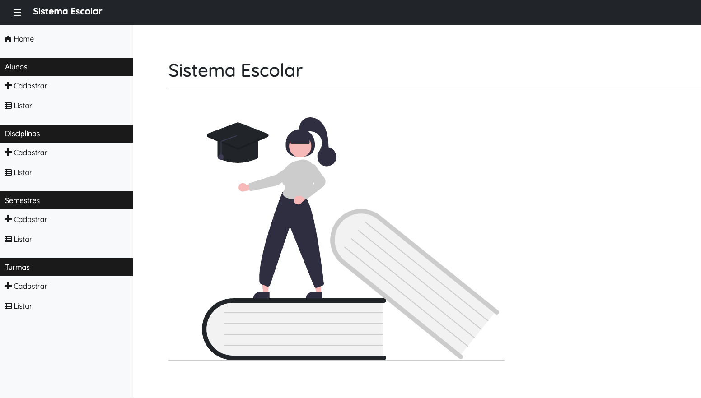

# Projeto para a disciplina de Tópicos em Java para Web

## Desenvolvimento de um Sistema Escolar

Este projeto é um sistema escolar desenvolvido como parte da disciplina de Tópicos em Java para Web. O sistema permite gerenciar alunos, turmas e semestres.

### Autor

Pedro Emanuel dos Santos Rodrigues

### Tecnologias Utilizadas

- Java
- Spring Boot
- Thymeleaf
- JPA/Hibernate
- MySQL
- Bootstrap
- jQuery

### Pré-requisitos

- JDK 17 ou superior
- Maven 3.6.0 ou superior
- MySQL 8.0 ou superior

### Configuração do Banco de Dados

1. Crie um banco de dados no MySQL:

```sql
CREATE DATABASE sistema_escolar;
```

2. Configure as propriedades de conexão no arquivo `application.properties`:

```properties
spring.datasource.url=jdbc:mysql://localhost:3306/sistema_escolar
spring.datasource.username=seu_usuario
spring.datasource.password=sua_senha
spring.jpa.hibernate.ddl-auto=update
spring.jpa.show-sql=true
spring.jpa.properties.hibernate.dialect=org.hibernate.dialect.MySQL8Dialect
```

### Acesso ao Sistema

Após iniciar a aplicação, acesse o sistema através do seguinte endereço:

[http://localhost:8080](http://localhost:8080)

### Imagem do Sistema


